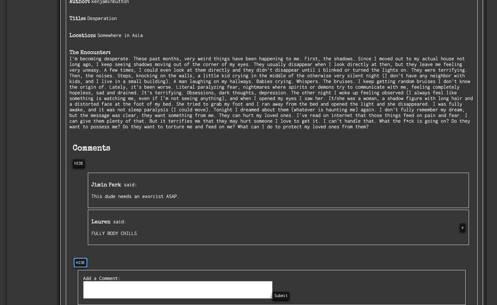

# 👻 Supernatural-Scribe 📜

---

## 📔 Desription:
Welcome to "Supernatural Scribe," the ultimate online forum where enthusiasts of the unknown gather to share their most captivating and hair-raising experiences with the supernatural. Delve into a myriad of chilling encounters, from ghostly whispers to alien abductions, as a vibrant community of believers and skeptics alike engage in discussions that blur the lines between reality and the paranormal. Join the conversation and immerse yourself in multimedia-enriched tales, and become part of a unique platform that celebrates the eerie, the unexplained, and the extraordinary.

### ✨ Features:
- View anonomously or log in to comment or submit an encounter.
- Bone chilly tales.
- Endless entertainment.
- Find your community.

## 👩🏽‍💻 Technologies Used:

MERN Stack:


Other:


 


### Preview:

View encounters and comments direct on the landing page without needing to create an account:


Sign up or Log in:


Create an Encounter:


Comment on Encounters:


## 🔍 Code Preview

Main Mongoose Model "Encounter":
```js
const mongoose = require('mongoose');

const encounterSchema = new mongoose.Schema({
  title: { type: String, required: true },
  location: { type: String, required: true },
  description: { type: String, required: true },
  createdBy: {
    type: mongoose.Schema.Types.ObjectId,
    ref: 'User',
    required: true,
  },
  comments: [{
    type: mongoose.Schema.Types.ObjectId,
    ref: 'Comment',
  }],
});

const Encounter = mongoose.model('Encounter', encounterSchema);

module.exports = Encounter;
```

Favorite Express Controller Method:
```js
// Create a new comment
async function createComment(req, res) {
  try {
    // Create a new Comment instance with data from the request body
    const comment = new Comment({
      text: req.body.text,
      createdBy: req.body.createdBy,
      encounter: req.body.encounter,
    });

    // Save the comment to the database
    await comment.save();
    
    // Populate the createdBy field with user's name and respond with the populated comment
    const populatedComment = await Comment.findById(comment._id).populate({
      path: 'createdBy',
      select: 'name',
    });

    // Respond with the populated comment
    res.status(201).json(populatedComment);
  } catch (error) {
    res.status(400).json({ error: 'Failed to create comment' });
  }
}
```

Favorite Component:

```jsx
// Functional component to display comments for an encounter
export default function Comments({ comments, user, onDeleteComment }) {
    // State to manage whether comments are shown or hidden
    const [showComments, setShowComments] = useState(false);

    // Function to toggle the display of comments
    const toggleComments = () => {
        setShowComments(!showComments);
    };

    // Render the comments section
    return (
        <div className='comments-container'>
            <h2>Comments</h2>
            {/* Button to toggle the display of comments */}
            <button onClick={toggleComments}>
                {showComments ? 'HIDE' : 'Display Comments'}
            </button>
            {/* Show comments if the showComments state is true */}
            {showComments && (
                <ul>
                    {/* Map through the comments array and render each comment */}
                    {comments.map(comment => {
                        return (
                            <li key={comment._id}>
                                <div className='comment-flex'>
                                    <div>
                                        {/* Display the comment author's name or "Stranger" */}
                                        <p>
                                            <span className='title'>
                                                {comment.createdBy ? comment.createdBy.name : 'Stranger'}
                                            </span> said: 
                                        </p>
                                        {/* Display the comment text */}
                                        <p>{comment.text}</p>
                                    </div>
                                    <div>
                                        {/* Show delete button for the comment's author */}
                                        {user && user._id === comment.createdBy._id && (
                                            <button id="delete-btn" onClick={() => onDeleteComment(comment._id)}>x</button>
                                        )}
                                    </div>
                                </div>
                            </li>
                        );
                    })}
                </ul>
            )}
        </div>
    );
}
```

## 💫 Getting Started:
Live Link:
✨[Live Link](https://supernatural-scribe-775c8db69f47.herokuapp.com/)✨

Trello:
[Trello](https://trello.com/b/mfAVT0Zt/project-4)

## 🧊 Next Steps and Icebox Items:

1. Create an edit profile feature.
2. Add abilty for user to add add a profile picture.
3. Create an "up vote" or "like" feature.
4. Add a search feature to filter topics/location.